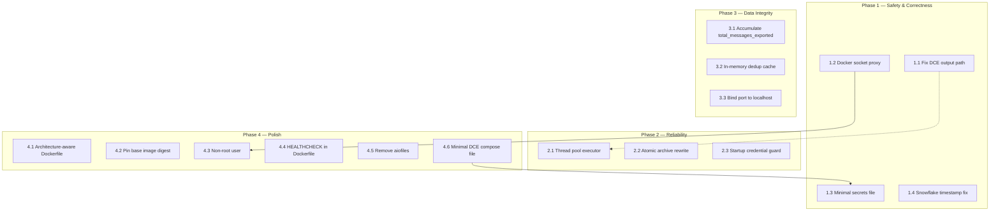

# History Service Refactoring Plan

Addresses all 17 critiques identified during architectural review. Tasks are grouped by area and ordered by dependency — critical safety and correctness items first, then reliability, then polish.

---

## Phase 1 — Safety & Correctness (Critical)

### Task 1.1: Fix DCE output path mismatch

**Critique:** §2.3 — DCE container cannot see `/archive/raw`, only `/out`.

**Files:** [`dce_orchestrator.py`](history-service/dce_orchestrator.py)

**Change:** The `--output` argument passed to DCE must use the path **as seen from inside the DCE container**, not the history-service container. Since DCE mounts cold storage at `/out`, the output directory should be `/out/<timestamp>` rather than `/archive/raw/<timestamp>`.

```python
# Before:
output_dir = os.path.join(ARCHIVE_RAW_DIR, _timestamp_dir())
# → /archive/raw/20260513T012918Z  (wrong — DCE has no /archive mount)

# After:
DCE_OUTPUT_ROOT = "/out"  # Path as seen from inside the DCE container
output_dir = os.path.join(DCE_OUTPUT_ROOT, _timestamp_dir())
# → /out/20260513T012918Z  (correct — maps to cold storage via DCE volume)
```

The `merge_export()` call after DCE completes still reads from the **host path** `/archive/raw/<timestamp>`, since that is where the data lands inside the history-service container. Add a constant mapping:

```python
DCE_OUTPUT_ROOT = "/out"              # Path as seen by DCE container
HOST_RAW_DIR = "/archive/raw"         # Path as seen by history-service (bind mount)
```

The merge step must be told the host path, not the DCE path. Store both and pass the appropriate one to each stage.

---

### Task 1.2: Replace Docker socket mount with socket proxy

**Critique:** §2.1 — `/var/run/docker.sock` mount grants host root access.

**Files:** [`docker-compose.yml`](docker-compose.yml), [`Dockerfile`](history-service/Dockerfile)

**Change:**

1. Add a `docker-socket-proxy` service to [`docker-compose.yml`](docker-compose.yml):
   ```yaml
   docker-socket-proxy:
     image: tecnativa/docker-socket-proxy:latest
     restart: unless-stopped
     volumes:
       - /var/run/docker.sock:/var/run/docker.sock:ro
     ports:
       - "127.0.0.1:2375:2375"
     environment:
       CONTAINERS_CREATE: "1"
       CONTAINERS_START: "1"
       CONTAINERS_STOP: "1"
       CONTAINERS_REMOVE: "1"
       IMAGES_PULL: "1"
   ```

2. In the `history-service` section, replace:
   ```yaml
   - /var/run/docker.sock:/var/run/docker.sock
   ```
   with:
   ```yaml
   - DOCKER_HOST=tcp://docker-socket-proxy:2375
   ```

3. The `docker compose run` command in [`dce_orchestrator.py`](history-service/dce_orchestrator.py) will automatically use the `DOCKER_HOST` environment variable to connect via TCP instead of the Unix socket.

---

### Task 1.3: Mount minimal secrets file instead of full `.env`

**Critique:** §2.2 — Full `.env` exposes `ANTHROPIC_API_KEY`, `HF_TOKEN`, etc.

**Files:** [`docker-compose.yml`](docker-compose.yml), [`dce_orchestrator.py`](history-service/dce_orchestrator.py)

**Change:**

1. Create a new file `dce.env` on the host containing only:
   ```
   DISCORD_TOKEN=<value>
   ```

2. In [`docker-compose.yml`](docker-compose.yml), replace:
   ```yaml
   - /home/peacow/local-ai-server/.env:/etc/.env:ro
   ```
   with:
   ```yaml
   - /home/peacow/local-ai-server/dce.env:/etc/dce.env:ro
   ```

3. In [`dce_orchestrator.py`](history-service/dce_orchestrator.py:67), update the compose invocation:
   ```python
   "--env-file", "/etc/dce.env",
   ```

4. Add `dce.env` to `.gitignore`. Document in README that this file must be created from `.env` or populated manually.

---

### Task 1.4: Fix `last_message_id` vs `last_message_timestamp` field confusion

**Critique:** §3.2 — Discord API returns `last_message_id` (Snowflake), not a timestamp.

**Files:** [`main.py`](history-service/main.py)

**Change:** In [`_fetch_discord_channels()`](history-service/main.py:248), extract the timestamp from the Snowflake instead of storing the raw ID:

```python
def _snowflake_to_timestamp(snowflake_id):
    """Extract UTC timestamp from a Discord Snowflake ID."""
    if not snowflake_id:
        return None
    epoch = 1420070400000  # Discord epoch
    timestamp_ms = (int(snowflake_id) >> 22) + epoch
    dt = datetime.fromtimestamp(timestamp_ms / 1000, tz=timezone.utc)
    return dt.isoformat()

# In the channel loop:
channels.append({
    "id": ch["id"],
    "name": ch.get("name", ""),
    "last_message_timestamp": _snowflake_to_timestamp(ch.get("last_message_id")),
})
```

Rename the field from `last_message_timestamp` to `last_message_at` throughout for consistency with the existing schema in [`channel_state.py`](history-service/channel_state.py).

---

## Phase 2 — Reliability (High)

### Task 2.1: Run blocking export pipeline in a thread pool executor

**Critique:** §3.1 — `POST /evaluate` blocks the asyncio event loop.

**Files:** [`main.py`](history-service/main.py)

**Change:** Wrap the synchronous export pipeline in `asyncio.to_thread()` so the event loop remains responsive:

```python
@app.post("/evaluate")
async def evaluate() -> dict:
    logger.info("Channel evaluation triggered via POST /evaluate")

    try:
        # Fetch channels (blocking HTTP call)
        channels = await asyncio.to_thread(_fetch_discord_channels)

        if not channels:
            return {"status": "error", "message": "Failed to fetch Discord channels"}

        logger.info(f"Fetched {len(channels)} channels from guild {DISCORD_GUILD_ID}")

        # Run export pipeline (blocking subprocess calls) in thread pool
        new_message_counts = await asyncio.to_thread(evaluate_and_export, channels)

        # Notify lora-training (blocking HTTP call)
        await asyncio.to_thread(_notify_lora_training, new_message_counts)

        return {
            "status": "complete",
            "channels_evaluated": len(channels),
            "users_updated": len(new_message_counts),
            "total_new_messages": sum(new_message_counts.values()),
        }
    except Exception as e:
        logger.error(f"Evaluation failed: {e}", exc_info=True)
        return {"status": "error", "message": str(e)}
```

---

### Task 2.2: Make `rewrite_archive()` atomic with write-then-rename

**Critique:** §3.4 — Direct `"w"` mode truncates on crash.

**Files:** [`jsonl_store.py`](history-service/jsonl_store.py)

**Change:** Replace direct file write with atomic temp-file-then-rename pattern:

```python
import tempfile

def rewrite_archive(user_id: str, records: List[dict]) -> None:
    path = _user_file_path(user_id)
    _ensure_archive_dir()

    try:
        # Write to temp file in same directory (ensures same filesystem for atomic rename)
        dir_name = os.path.dirname(path)
        fd, tmp_path = tempfile.mkstemp(dir=dir_name, suffix=".tmp", prefix=os.path.basename(path))
        try:
            with os.fdopen(fd, "w") as f:
                for record in records:
                    f.write(json.dumps(record, ensure_ascii=False) + "\n")
            # Atomic rename on POSIX
            os.replace(tmp_path, path)
        except Exception:
            # Clean up temp file on failure
            try:
                os.unlink(tmp_path)
            except OSError:
                pass
            raise

        logger.info(f"Rewrote archive for user {user_id}: {len(records)} records")
    except IOError as e:
        logger.error(f"Failed to rewrite archive for user {user_id}: {e}")
```

---

### Task 2.3: Add startup guard for required credentials

**Critique:** §3.7 — Empty `DISCORD_TOKEN` fails silently at runtime.

**Files:** [`config.py`](history-service/config.py), [`main.py`](history-service/main.py)

**Change:** Add a validation function in [`config.py`](history-service/config.py):

```python
def validate_required() -> None:
    """Check required environment variables at startup."""
    missing = []
    if not DISCORD_TOKEN:
        missing.append("DISCORD_TOKEN")
    if not DISCORD_GUILD_ID:
        missing.append("DISCORD_GUILD_ID")
    if not PROXY_URL:
        missing.append("PROXY_URL")

    if missing:
        raise ValueError(
            f"Missing required environment variables: {', '.join(missing)}. "
            "Check your .env file or docker-compose.yml environment section."
        )
```

Call from [`main.py`](history-service/main.py) lifespan startup:

```python
@asynccontextmanager
async def lifespan(app: FastAPI):
    # Validate required config before starting
    from config import validate_required
    validate_required()

    logger.info("History service starting up")
    ...
```

---

## Phase 3 — Data Integrity (Medium)

### Task 3.1: Accumulate `total_messages_exported` instead of overwriting

**Critique:** §3.3 — Cumulative counter is replaced each export.

**Files:** [`dce_orchestrator.py`](history-service/dce_orchestrator.py)

**Change:** In [`evaluate_and_export()`](history-service/dce_orchestrator.py:186), read the existing count from state before updating:

```python
# Before update_channel call:
existing_record = get_channel(state, channel_id)
previous_total = existing_record.get("total_messages_exported", 0) if existing_record else 0
new_total = previous_total + total_exported

update_channel(
    state,
    channel_id=channel_id,
    channel_name=channel_name,
    last_export_at=now,
    last_message_at=ch.get("last_message_at"),
    total_messages_exported=new_total,
)
```

---

### Task 3.2: Cache in-memory dedup set to avoid repeated full-file scans

**Critique:** §3.5 — O(n) scan per batch per channel.

**Files:** [`jsonl_store.py`](history-service/jsonl_store.py)

**Change:** Add a module-level cache that is loaded once at startup and kept in memory for the lifetime of the service:

```python
# Module-level cache: user_id -> set of known message_ids
_user_id_cache: Dict[str, Set[str]] = {}

def _load_existing_ids(user_id: str) -> Set[str]:
    if user_id in _user_id_cache:
        return _user_id_cache[user_id]

    # Load from disk and cache
    ids = set()
    path = _user_file_path(user_id)
    if not os.path.exists(path):
        _user_id_cache[user_id] = ids
        return ids

    try:
        with open(path, "r") as f:
            for line in f:
                line = line.strip()
                if not line:
                    continue
                try:
                    record = json.loads(line)
                    msg_id = record.get("message_id")
                    if msg_id:
                        ids.add(msg_id)
                except json.JSONDecodeError:
                    continue
    except IOError as e:
        logger.error(f"Failed to read existing IDs for user {user_id}: {e}")

    _user_id_cache[user_id] = ids
    return ids

def _add_to_cache(user_id: str, msg_ids: Set[str]) -> None:
    """Update in-memory cache after successful append."""
    if user_id not in _user_id_cache:
        _user_id_cache[user_id] = set()
    _user_id_cache[user_id].update(msg_ids)
```

Update [`append_messages()`](history-service/jsonl_store.py:99) to call `_add_to_cache()` after writing.

---

### Task 3.3: Bind port 11437 to localhost only

**Critique:** §3.6 — Port exposed on `0.0.0.0` despite "internal only" intent.

**Files:** [`docker-compose.yml`](docker-compose.yml)

**Change:** Replace:
```yaml
ports:
  - "11437:11437"
```
with:
```yaml
ports:
  - "127.0.0.1:11437:11437"
```

This restricts access to localhost on the host machine. Other Docker services can still reach `history-service` via the internal Docker network using the service name `http://history-service:11437`.

---

## Phase 4 — Polish (Low)

### Task 4.1: Parameterise Docker CLI architecture in Dockerfile

**Critique:** §1.1 — Hardcoded `x86_64` breaks on ARM.

**Files:** [`Dockerfile`](history-service/Dockerfile)

**Change:** Use Docker build args to select the correct architecture:

```dockerfile
ARG TARGETARCH=x86_64
# Map Docker's architecture names to Docker CLI download names
ARG DOCKER_CLI_ARCH=${TARGETARCH}
# Override for common aliases
RUN echo "Building for arch: ${DOCKER_CLI_ARCH}"

# Then use ${DOCKER_CLI_ARCH} in download URLs instead of x86_64
```

For a more robust approach, add an architecture mapping:

```dockerfile
ARG TARGETARCH
ARG DOCKER_VERSION=28.5.2
ARG COMPOSE_VERSION=2.39.1

# Map Docker TARGETARCH to download URL path
RUN if [ "$TARGETARCH" = "arm64" ]; then \
        DOCKER_ARCH="aarch64"; \
        COMPOSE_ARCH="aarch64"; \
    elif [ "$TARGETARCH" = "amd64" ]; then \
        DOCKER_ARCH="x86_64"; \
        COMPOSE_ARCH="x86_64"; \
    else \
        echo "Unsupported architecture: $TARGETARCH" && exit 1; \
    fi && \
    curl -fsSL "https://download.docker.com/linux/static/stable/${TARGETARCH}/docker-${DOCKER_VERSION}.tgz" | \
        tar xz --strip-components=1 -C /usr/local/bin docker/docker && \
    mkdir -p /usr/local/lib/docker/cli-plugins && \
    curl -fsSL "https://github.com/docker/compose/releases/download/v${COMPOSE_VERSION}/docker-compose-linux-${COMPOSE_ARCH}" \
        -o /usr/local/lib/docker/cli-plugins/docker-compose && \
    chmod +x /usr/local/lib/docker/cli-plugins/docker-compose
```

---

### Task 4.2: Pin base image to digest

**Critique:** §1.2 — Floating `python:3.11-slim` tag.

**Files:** [`Dockerfile`](history-service/Dockerfile)

**Change:** Look up the current digest for `python:3.11-slim` and pin it:

```dockerfile
FROM python:3.11-slim@sha256:<current-digest>
```

Add a comment with the date and a reminder to update periodically.

---

### Task 4.3: Add non-root user to Dockerfile

**Critique:** §1.3 — Container runs as root.

**Files:** [`Dockerfile`](history-service/Dockerfile)

**Change:** Add a dedicated user after installing dependencies:

```dockerfile
# Create non-root user
RUN groupadd -r appuser && useradd -r -g appuser -d /app -s /sbin/nologin appuser
WORKDIR /app
COPY --chown=appuser:appuser . .
USER appuser
```

Note: The Docker socket proxy (Task 1.2) eliminates the need for direct socket access, so the non-root user can operate without special privileges. If the service still needs to write to `/archive/`, ensure the bind mount directory is writable by the app user or add a `chown` step.

---

### Task 4.4: Add HEALTHCHECK instruction to Dockerfile

**Critique:** §1.4 — No self-describing health check in image.

**Files:** [`Dockerfile`](history-service/Dockerfile)

**Change:** Add before `CMD`:

```dockerfile
HEALTHCHECK --interval=30s --timeout=10s --retries=3 --start-period=10s \
    CMD python -c "import urllib.request; urllib.request.urlopen('http://localhost:11437/health')" || exit 1
```

---

### Task 4.5: Remove unused `aiofiles` dependency

**Critique:** §1.5 — `aiofiles` declared but never imported.

**Files:** [`requirements.txt`](history-service/requirements.txt)

**Change:** Remove the line:
```
aiofiles>=23.2.0
```

---

### Task 4.6: Mount minimal DCE-only compose file

**Critique:** §2.4 — Full compose file mounted exposes stack topology.

**Files:** [`docker-compose.yml`](docker-compose.yml), new file `dce-compose.yml`

**Change:**

1. Create `dce-compose.yml` containing only the `discord-chat-exporter` service:
   ```yaml
   services:
     discord-chat-exporter:
       image: tyrrrz/discordchatexporter:latest
       environment:
         - DISCORD_TOKEN=${DISCORD_TOKEN}
       volumes:
         - /mnt/storage_cold/array/DiscordArchive/raw:/out
   ```

2. In [`docker-compose.yml`](docker-compose.yml), replace:
   ```yaml
   - /home/peacow/local-ai-server/docker-compose.yml:/etc/docker-compose.yml:ro
   ```
   with:
   ```yaml
   - /home/peacow/local-ai-server/dce-compose.yml:/etc/dce-compose.yml:ro
   ```

3. In [`dce_orchestrator.py`](history-service/dce_orchestrator.py:66), update:
   ```python
   "-f", "/etc/dce-compose.yml",
   ```

4. Remove the `--profile manual` flag since the minimal compose file has no profiles.

---

## Execution Order



**Key dependencies:**
- Task 1.2 (socket proxy) must precede Task 4.3 (non-root user), since the non-root user cannot access the Docker socket directly.
- Task 4.6 (minimal compose file) simplifies Task 1.3 (minimal secrets).
- Tasks within each phase are independent and can be executed in parallel.

---

## Files Modified Summary

| File | Tasks |
|---|---|
| [`history-service/Dockerfile`](history-service/Dockerfile) | 1.2, 4.1, 4.2, 4.3, 4.4 |
| [`history-service/dce_orchestrator.py`](history-service/dce_orchestrator.py) | 1.1, 1.2, 1.3, 3.1, 4.6 |
| [`history-service/main.py`](history-service/main.py) | 1.4, 2.1, 2.3 |
| [`history-service/jsonl_store.py`](history-service/jsonl_store.py) | 2.2, 3.2 |
| [`history-service/config.py`](history-service/config.py) | 2.3 |
| [`history-service/requirements.txt`](history-service/requirements.txt) | 4.5 |
| [`docker-compose.yml`](docker-compose.yml) | 1.2, 1.3, 3.3, 4.6 |
| `dce-compose.yml` (new) | 4.6 |
| `dce.env` (new, gitignored) | 1.3 |
